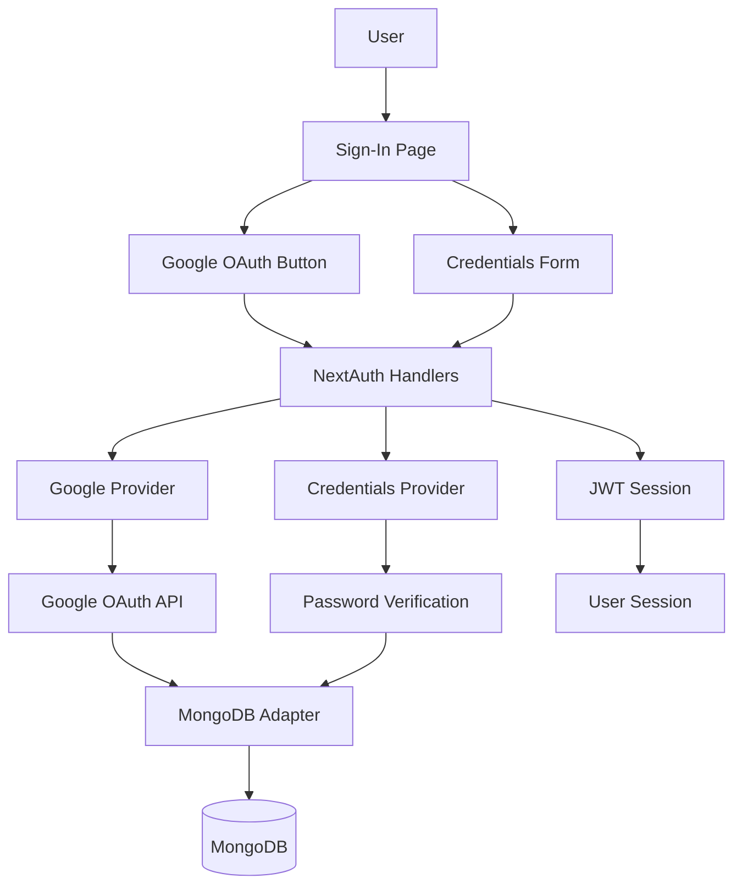

# Design Document: Google OAuth Authentication

## Overview

This design implements Google OAuth authentication alongside the existing Credentials provider in a NextAuth v5 application. The architecture ensures complete separation between authentication methods, with each creating independent user entries in MongoDB. The implementation leverages NextAuth's built-in Google provider and MongoDBAdapter, requiring minimal code changes while maintaining backward compatibility with existing credentials-based users.

The key design principle is **authentication method isolation**: users authenticated via Google OAuth and those using credentials are treated as completely separate entities, even if they share the same email address. This prevents accidental account linking and maintains clear data boundaries.

## Architecture

### High-Level Architecture



### Authentication Flow Comparison

**Google OAuth Flow:**
1. User clicks "Continue with Google" button
2. NextAuth redirects to Google OAuth consent screen
3. User grants permission
4. Google redirects back with authorization code
5. NextAuth exchanges code for user profile
6. MongoDBAdapter creates/retrieves user entry (without password field)
7. JWT session created with user ID
8. User redirected to /entry page

**Credentials Flow:**
1. User enters username/email and password
2. NextAuth calls Credentials provider authorize function
3. System queries MongoDB for user by username or email
4. Password verified using bcrypt
5. JWT session created with user ID
6. User redirected to /entry page

### Key Design Decisions

1. **No Account Linking**: The MongoDBAdapter naturally creates separate user entries for different authentication methods. We explicitly avoid implementing any account linking logic.

2. **Password Field as Discriminator**: The presence of a password field distinguishes credentials users from OAuth users. OAuth users will never have a password field.

3. **JWT Session Strategy**: Using JWT (not database sessions) keeps the implementation stateless and performant. The JWT contains the user ID which is used for all data queries.

4. **Environment Variable Validation**: The application will start even if Google OAuth credentials are missing, but will log warnings. This allows development without OAuth configured.

## Components and Interfaces

### 1. NextAuth Configuration (auth.ts)

**Current State:**
- Google provider already configured but needs environment variables
- Credentials provider fully functional
- MongoDBAdapter connected
- JWT session strategy enabled

**Required Changes:**
- Verify environment variables are properly loaded
- Ensure callbacks correctly handle both authentication methods
- No structural changes needed

**Interface:**
```typescript
// auth.ts exports
export const { handlers, auth, signIn, signOut } = NextAuth({
  adapter: MongoDBAdapter(clientPromise),
  session: { strategy: "jwt" },
  providers: [
    Google({
      clientId: process.env.AUTH_GOOGLE_ID!,
      clientSecret: process.env.AUTH_GOOGLE_SECRET!,
    }),
    Credentials({ /* existing config */ })
  ],
  callbacks: {
    async jwt({ token, user }) { /* existing logic */ },
    async session({ session, token }) { /* existing logic */ }
  }
});
```

### 2. Sign-In Page Component (app/signin/page.tsx)

**Current State:**
- Google button already exists and functional
- Credentials form fully implemented
- Error handling in place
- Loading states managed

**Required Changes:**
- None - the UI is already complete

**Component Structure:**
```typescript
export default function SignIn() {
  // State management
  const [isLoading, setIsLoading] = useState<"google" | "credentials" | null>(null);
  const [error, setError] = useState<string | null>(null);
  
  // OAuth handler
  const handleOAuthSignIn = async (provider: "google") => {
    await nextAuthSignIn(provider, { callbackUrl: "/entry" });
  };
  
  // Credentials handler
  const handleCredentialsSignIn = async (e: React.FormEvent) => {
    const result = await nextAuthSignIn("credentials", {
      username, password, redirect: false
    });
  };
  
  return (
    // UI with Google button and credentials form
  );
}
```

### 3. MongoDB Adapter Integration

**Behavior:**
The MongoDBAdapter automatically handles user creation and retrieval. It creates different document structures based on the authentication method:

**OAuth User Document:**
```typescript
{
  _id: ObjectId,
  email: string,
  name: string,
  image: string,
  emailVerified: Date | null,
  // NO password field
}
